<div align="center">
  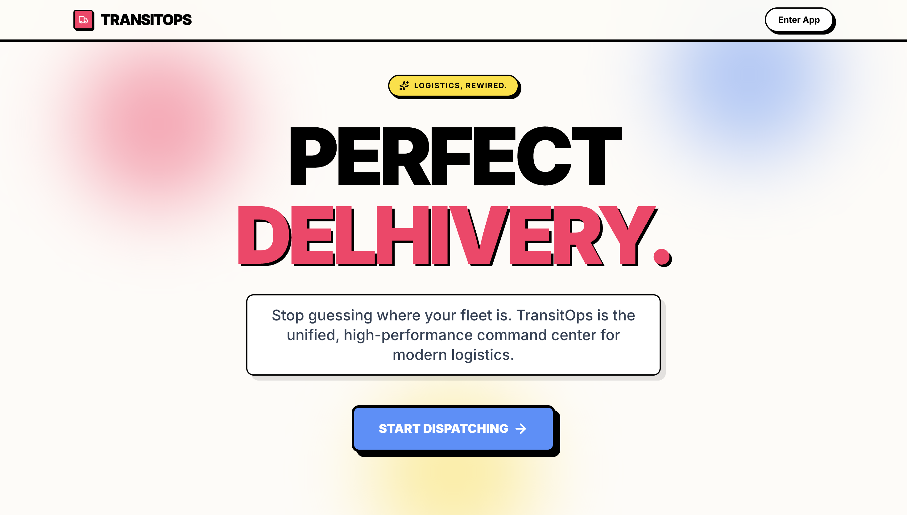
  <h1>TransitOps</h1>
  <p><strong>The unified, high-performance command center for modern logistics.</strong></p>
</div>

<br />
<h1>Checkout here https://transitops-git-main-arsheel-patels-projects-0ae29f54.vercel.app/**</h1>

## 🚀 The Pitch

Stop guessing where your fleet is. TransitOps is a next-generation logistics operating system designed to unify your entire transportation ecosystem. It connects your physical fleet to a central AI-ready dispatch brain, enabling real-time routing, automated maintenance triggers, and comprehensive financial tracking in a beautifully crafted, Gen-Z inspired interface.

Whether you're dispatching a single truck or managing a nationwide fleet, TransitOps provides the visibility, compliance tracking, and predictive insights you need to operate at peak efficiency.

---

## ✨ Features

- **Live Tracking Command Center**: Track your vehicles in real-time on a gorgeous dark-mode map with glowing routes, floating vehicle cards, and animated ETAs.
- **AI-Predictive Insights**: Automatically detect anomalous engine telemetry to forecast maintenance, and optimize routes based on real-time traffic to maximize efficiency.
- **Drag-and-Drop Dispatching**: An intuitive, Kanban-style board to effortlessly move trips from "Ready" to "In Transit" to "Completed".
- **Comprehensive Fleet Management**: Track vehicle registration, mileage, capacity, and current assignment statuses seamlessly.
- **Proactive Maintenance**: Preventative and reactive maintenance tracking that automatically flags vehicles for service and calculates repair costs.
- **Executive Analytics**: A CEO-level dashboard featuring fleet utilization, regional activity heatmaps, driver safety rankings, and ROI tracking.

---

## 📸 Gallery

<details open>
<summary><b>Click to view Screenshots</b></summary>
<br>

<div align="center">
  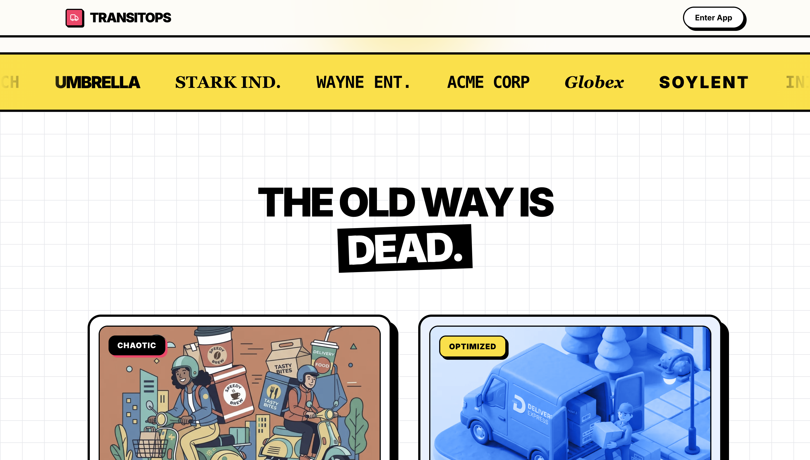
  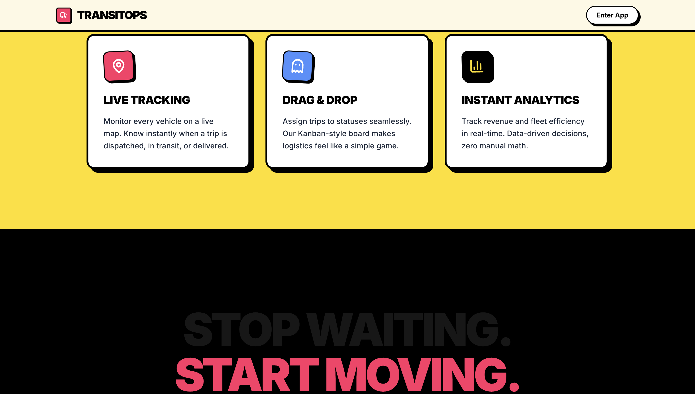
</div>
<br>
<div align="center">
  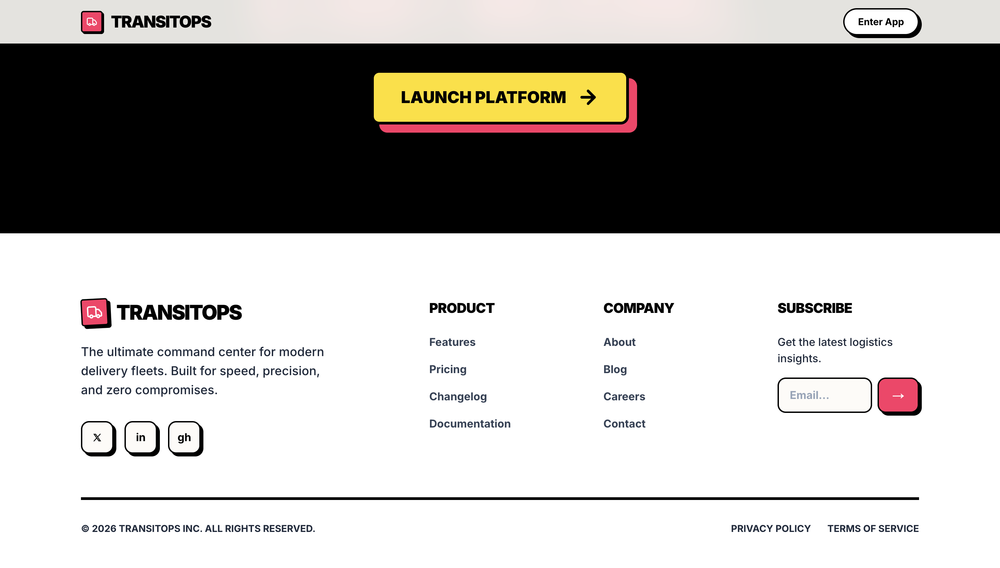
  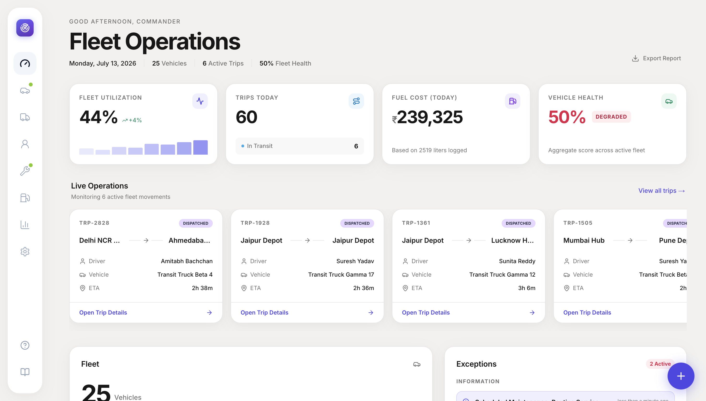
</div>
<br>
<div align="center">
  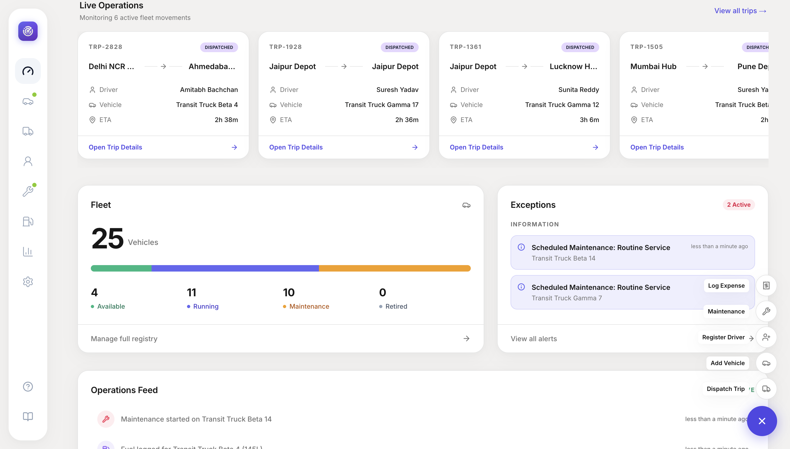
  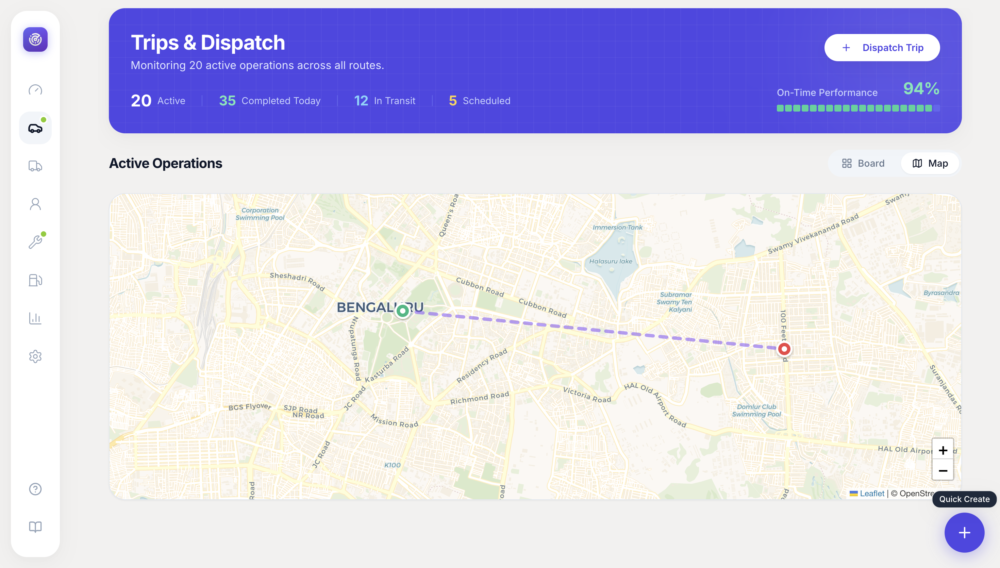
</div>
<br>
<div align="center">
  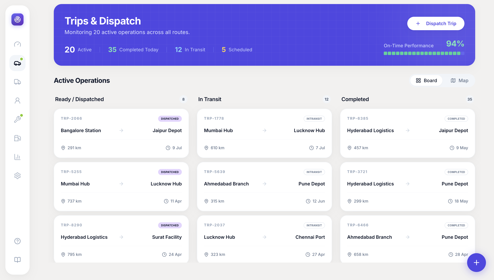
  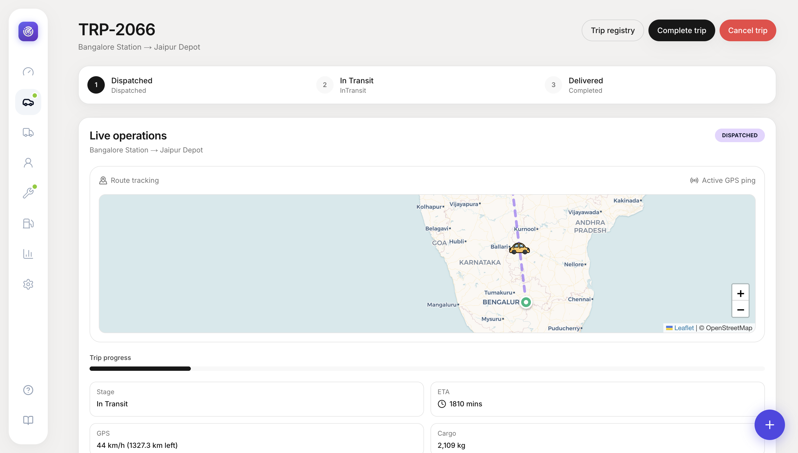
</div>
<br>
<div align="center">
  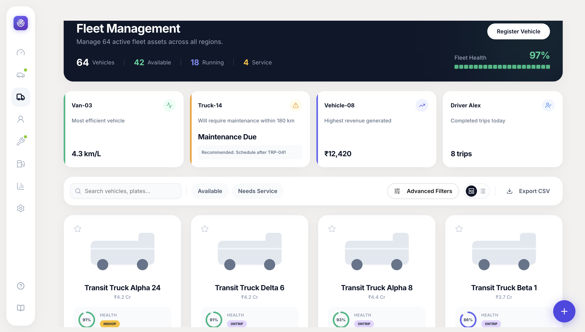
  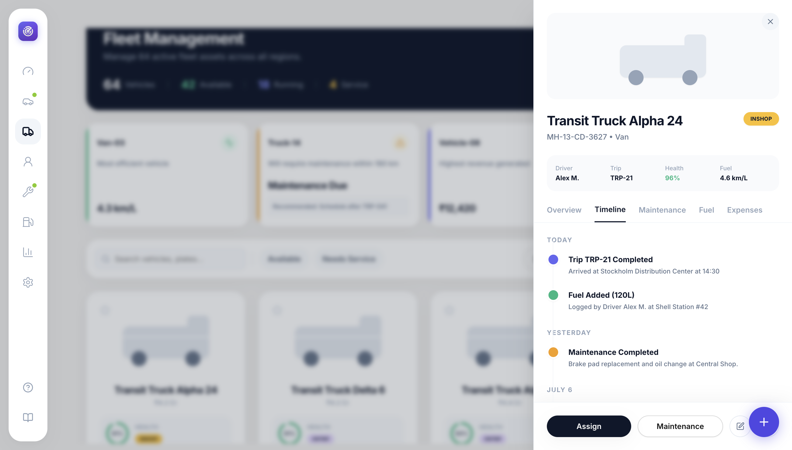
</div>
<br>
<div align="center">
  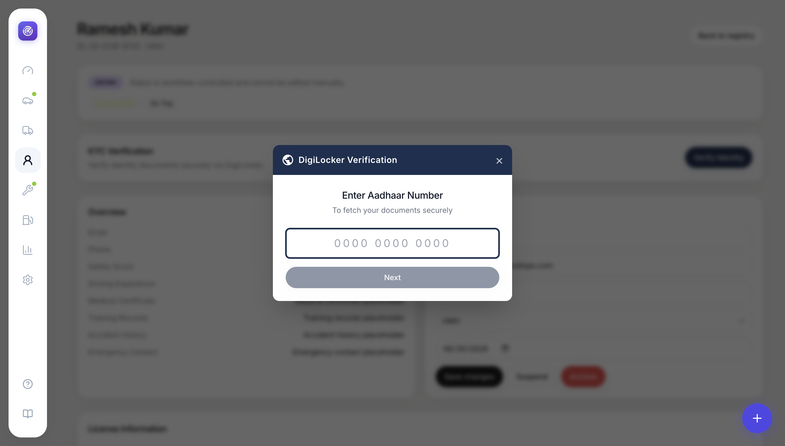
  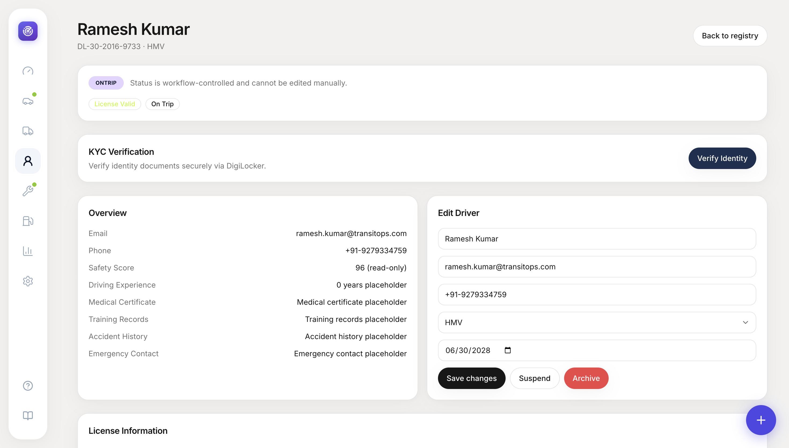
</div>
<br>
<div align="center">
  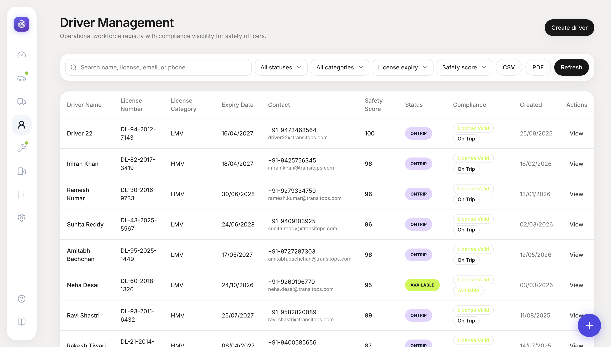
  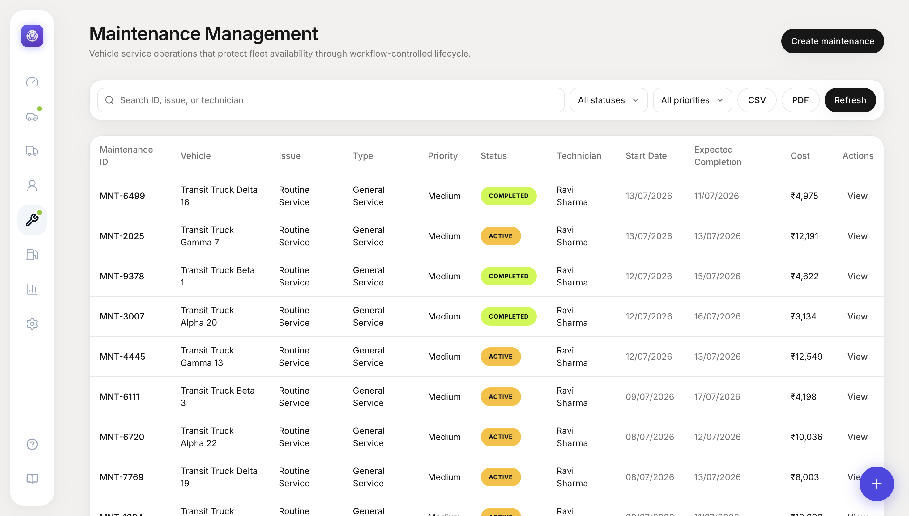
</div>
<br>
<div align="center">
  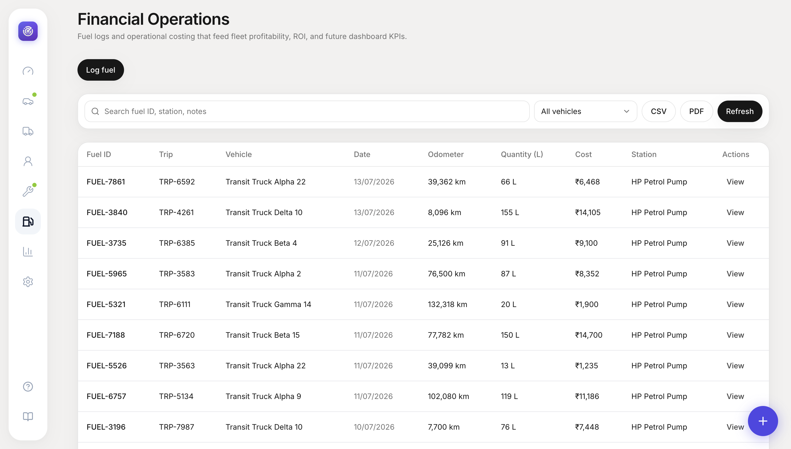
  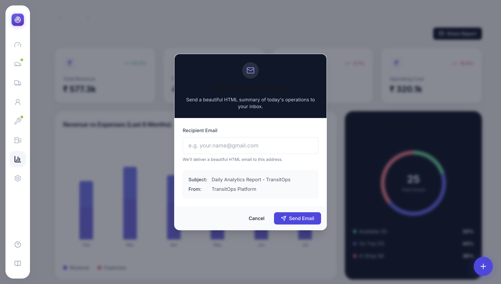
</div>
<br>
<div align="center">
  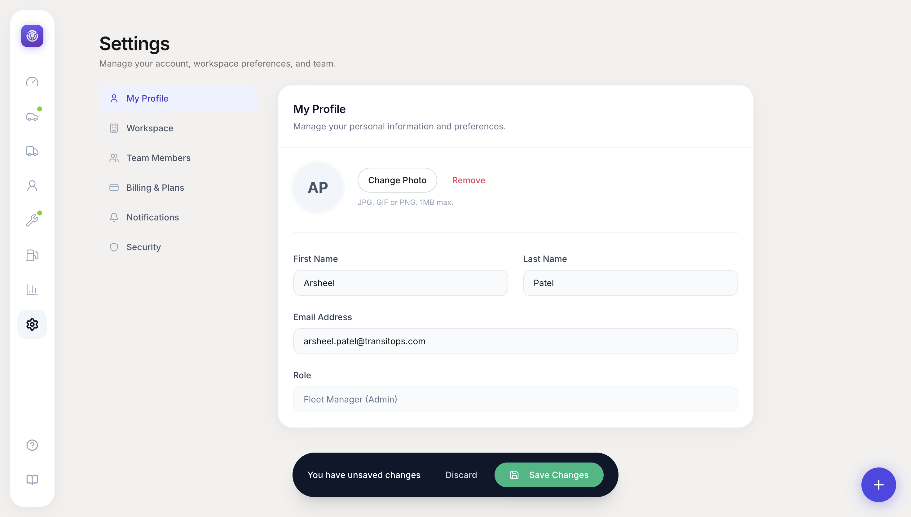
</div>

</details>

---

## 🏗️ Platform Architecture

The platform architecture connects the physical fleet to a central dispatch brain:

1. **Centralized Dispatching:** All active trips, unassigned routes, and drivers are pooled into a central, AI-ready dispatch matrix.
2. **Real-time Telemetry:** Vehicles stream their geolocation and health status back to the platform, automatically updating ETAs and triggering maintenance alerts.
3. **Unified Resource Management:** The system ensures that a driver, a healthy vehicle, and an active route are perfectly synchronized before any dispatch occurs.
4. **Proactive Compliance:** Regulatory checks and safety requirements are enforced system-wide, preventing non-compliant operations.

---

## 🛠️ Tech Stack

- **Framework**: [Next.js 14](https://nextjs.org/) (App Router)
- **Language**: TypeScript
- **Styling**: Tailwind CSS & Framer Motion
- **Maps**: React Leaflet
- **Drag & Drop**: @dnd-kit
- **Icons**: Lucide React

---

## 💻 Setup & Installation

Follow these steps to get TransitOps running locally on your machine:

### 1. Clone the repository
```bash
git clone https://github.com/ArsheelPatel06/Odoo-Hack2026.git
cd Odoo-Hack2026
```

### 2. Install dependencies
Ensure you have Node.js installed, then run:
```bash
npm install
# or
yarn install
# or
pnpm install
```

### 3. Environment Variables
Create a `.env` file in the root directory (if required by future backend integrations). For now, the application runs entirely on mock data and local state for demo purposes.

### 4. Run the development server
```bash
npm run dev
```

### 5. Open the app
Navigate to [http://localhost:3000](http://localhost:3000) in your browser. You can log in using any of the mock roles provided (e.g., Fleet Manager, Dispatcher, Safety Officer) to experience the full RBAC system.

---

<div align="center">
  <p>Built for Odoo Hack 2026 🚀</p>
</div>
